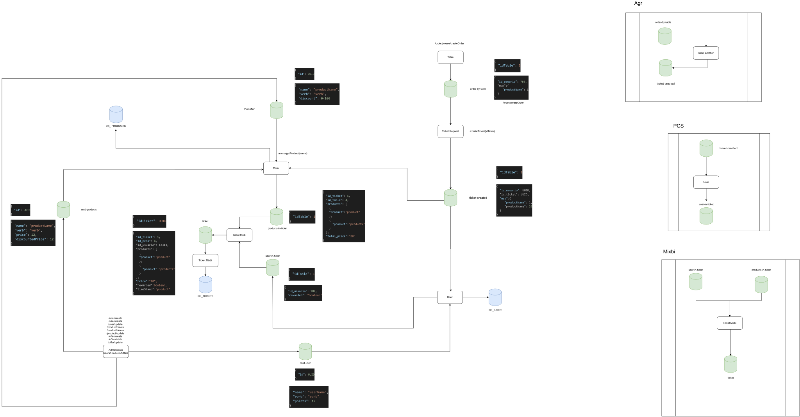

# Kafeberus

This is a Java Maven project for a restaurant management system. [Diagram](#diagram) of the project

## Getting Started

To get started with this project, you will need to have Maven installed on your system. You can install Maven by following the instructions on the [official website](https://maven.apache.org/install.html).

Once you have Maven installed, you can build the project by running the following command:

``mvn clean install -DskipTests``

This will compile the project and generate the necessary artifacts.

## Modules

This project is divided into several modules, each of which provides a specific functionality:

* [`admin`](Kafeberus/admin): Provides a REST API for managing products, offers, and users.
* [`menu`](kafeberus/menu): Provides a web interface for customers to view the restaurant's menu and place orders.
* [`table`](kafeberus/table): Provides a REST API for managing orders from a table.
* [`ticketMixbi`](kafeberus/ticketMixbi):Provides a Kafka consumer and producer who joins the information from products and user giving the body for the final ticket.
* [`ticketRequest`](kafeberus/ticketRequest): Provides a Kafka consumer for processing ticket requests.
* [`ticketRecord` ](kafeberus/ticketRecord):Provides a Kafka consumer for saving tickets in the db.

## Services

| Service       | Consumer                             | Producer                            |
|---------------|--------------------------------------|-------------------------------------|
| admin         |                                      | crud-product, crud-offer, crud-user |
| menu          | ticket-created                       | products-in-ticket                  |
| menu          | crud-offer                           |                                     |
| menu          | crud-product                         |                                     |
| table         |                                      | order-by-table                      |
| ticketRecord  | ticket                               |                                     |
| ticketMixbi   | products-in-ticket && user-in-ticket | ticket                              |
| ticketRequest | order-by-table                       | ticket-created                      |
| user          | crud-user                            |                                     |
| user          | ticket-created                       | user-in-ticket                      |    

To run the services, you can use the services option in the menus of your IDE if you are using IntelliJ IDEA, manually if you are using the community version, otherwise the applications are there automatically.

Alternatively, you can run the services one-by-one by navigating to the module directory and running the following command:

### Execution
#### Services
You can use the services option in the menus of your IDE if you are using IntelliJ IDEA,
manually if you are using the community version, otherwise the applications are there automatically.

#### Compound
Go to run -> edit configuration and add a compound with all teh applications.
#### One-by-one

## Admin
### Authorization
To use the `admin` service, you will need to include the `Authorization` header with a value of `KafkaGang`. This will allow you to create products, offers, and users.

## Menu
It provides access to the information of products. The offers act directly to the products, we have
2 endpoints ``/getProduct/{name}`` and ``/getProducts``

## Table

A customer would be eating in his table. The key of their order can be used to track their order status.
We can order a product via endpoint ``/order/please/createOrder``

## Ticket Request

Provides a Kafka consumer for processing the orders of a user in a table. 
Endpoint ``/createTicket/{idTable}``

## Ticket Mixbi
It joins the information of a user with the current information of the products ordered.

## Ticket  Record
Save the information of the ticket in the db.

## User
Manages actions performed on users and gives information of a user like his points.

# Diagram
